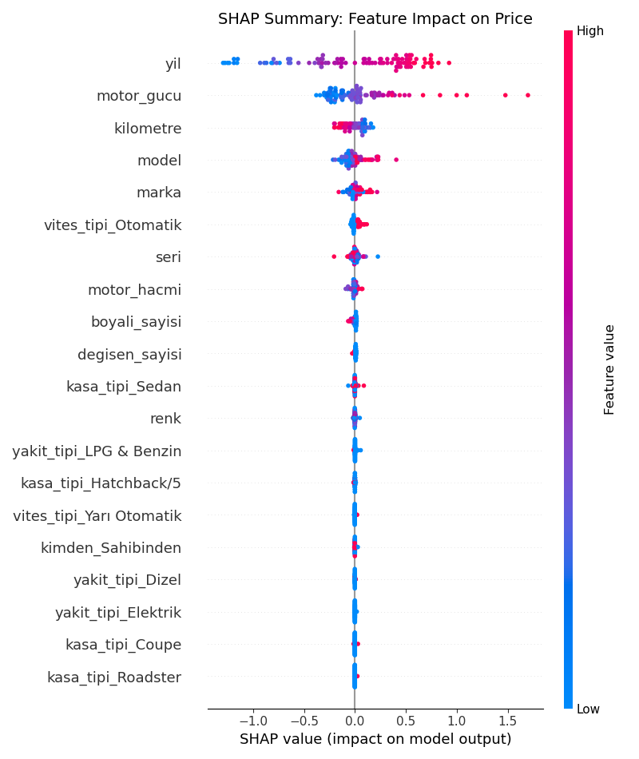
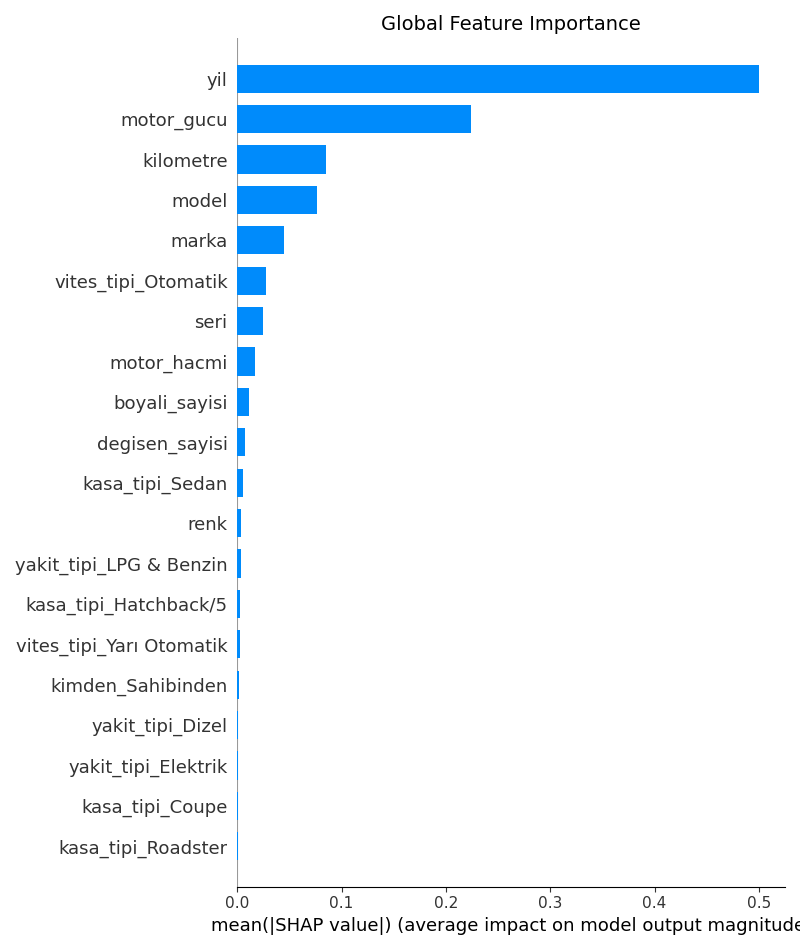
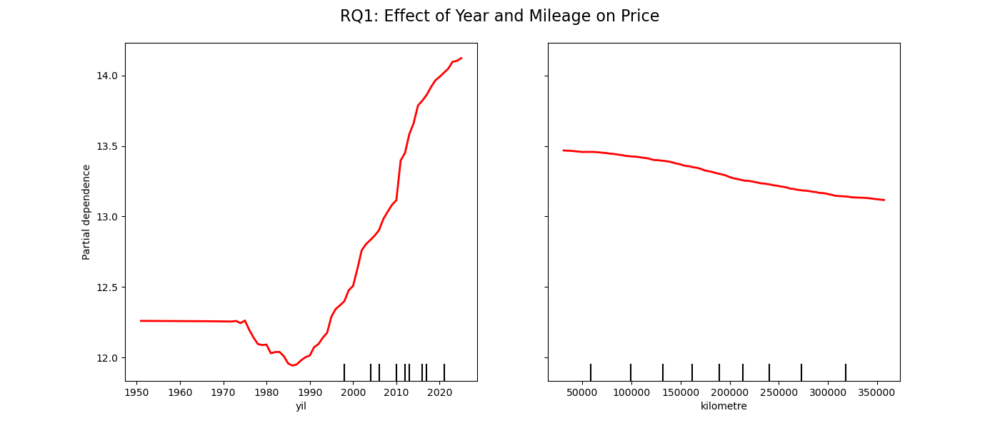

# 🚗 Used Car Price Prediction (Turkey)

## 📖 Description
Predicting used car prices in Turkey is challenging due to economic fluctuations and high inflation. In this project, we built a regression model to estimate car prices based on features like **Make, Model, Year, Mileage (km), and Engine Power**.

The goal is to determine the fair market value of a vehicle and understand which features affect the price the most using interpretability tools like **SHAP**.

---

## 📂 Dataset and Preprocessing
We used a dataset containing approximately **50,000** car listings.

### Preprocessing Steps 🛠️
* **Cleaning:**
  * Removed outliers: Prices < 50,000 TL or > 20,000,000 TL.
  * Removed vehicles with mileage > 1,000,000 km.
* **Missing Values:**
  * Technical specs (`motor_hacmi`, `motor_gucu`) filled with **Median**.
  * Categorical columns filled with **Mode**.
* **Feature Engineering:**
  * **Log Transformation:** Applied `np.log1p` to the 'Price' column.
  * **Encoding:** Label Encoding for Brand/Model, One-Hot Encoding for Gear/Fuel types.

---

## 🤖 Methodology
We tested three regression models:

1. **Linear Regression (OLS):** Baseline model.
2. **XGBoost:** Gradient boosting method.
3. **Random Forest Regressor:** Selected as the **final model** (Best Performance).

---

## 📈 Model Results (Test Set)
The models were evaluated on **Real TL prices** (inverse log-transformed).

| Model | R² Score | MAE (TL) | RMSE (TL) | Status |
|-------|----------|----------|-----------|--------|
| **Random Forest** | **0.8984** | **88,540 ₺** | **325,017 ₺** | 🏆 **Winner** |
| XGBoost | 0.8875 | 101,719 ₺ | 341,924 ₺ | Competitive |
| Linear Regression | 0.6561 | 195,877 ₺ | 597,841 ₺ | Baseline |

> **Insight:** Tree-based models reduced the error by **~50%** compared to Linear Regression.

## 🔍 Visualizations & Explainability

### 1. SHAP Summary Plot
Shows which features push the price up (red) or down (blue).


### 2. Feature Importance
The most critical factors driving the price.


### 3. Year & Mileage Analysis (RQ1)
How does the car's age and usage affect its value?


## 🚀 How to Run

### 1. Install Dependencies
```bash
pip install -r requirements.txt
2. Run Scripts
Step 1: Prepare Data
```
```bash
python src/car_price_prepare.py
Step 2: Train Model
```
```bash
python src/car_price_train.py
Step 3: Visualize Results
```
```bash
python src/car_price_shap.py
👥 Authors
[ANIL AYDIN] - [220717047]

[HAKAN ENES ERİŞEN] - [220717605]
```
